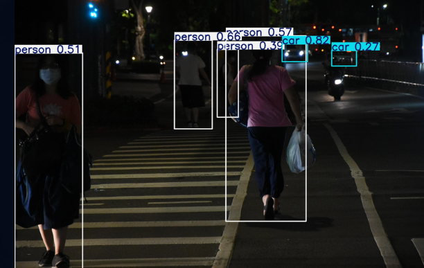
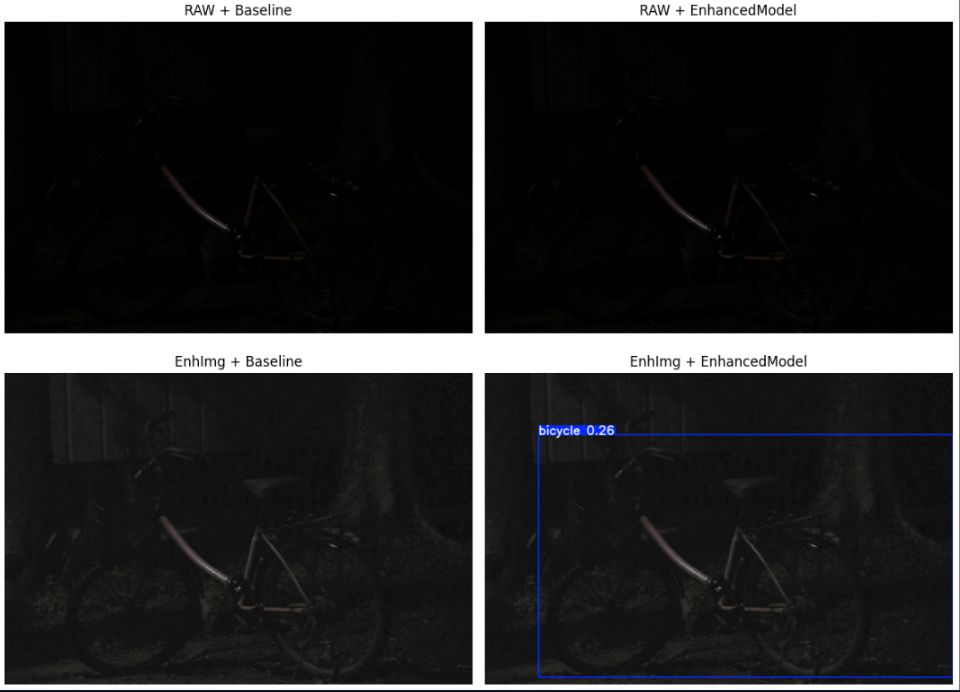
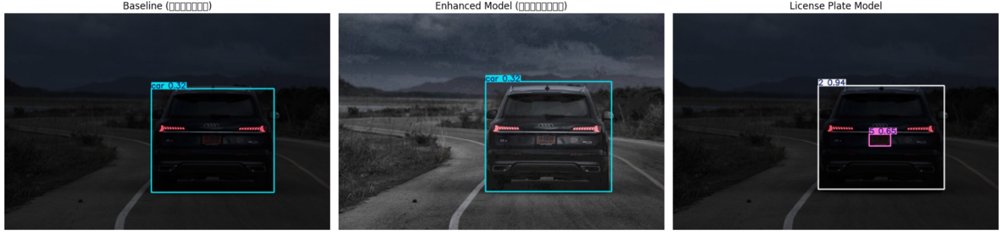
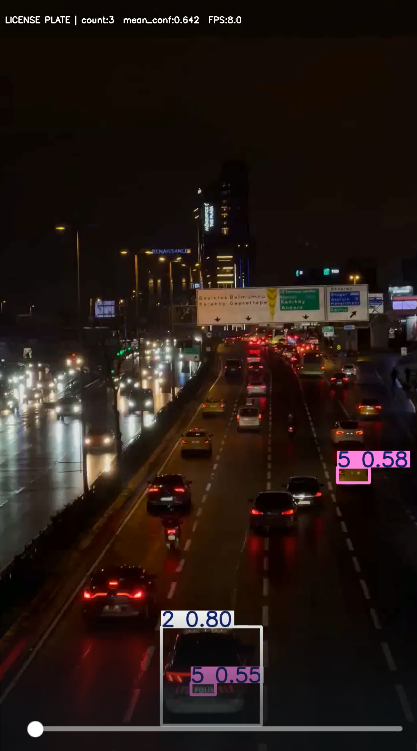
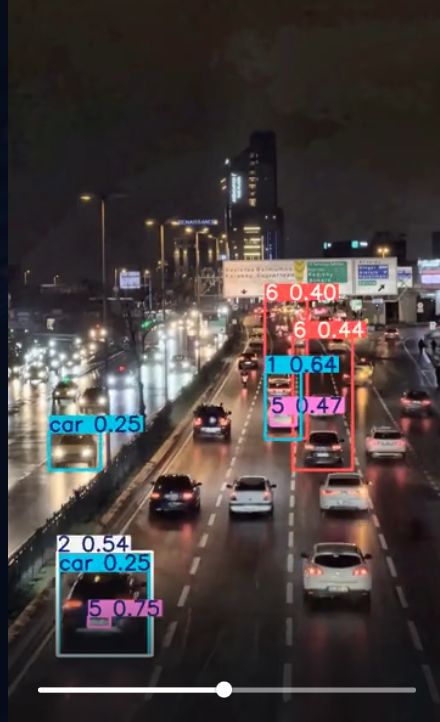

# 🚘 Low-Light Vehicle & License Plate Detection using YOLOv8


> **An advanced object detection project designed to identify vehicles and license plates in challenging low-light conditions.**

This project addresses the limitations of standard detection models in dark environments by implementing a robust **Image Preprocessing Pipeline**. By leveraging **CLAHE** and **Gamma Correction**, the system enhances image visibility and contrast before feeding data into the **YOLOv8** model, significantly improving detection accuracy at night.

## 💡 Methodology: The Enhancement Pipeline

To ensure the model performs well in low-light scenarios, I implemented a preprocessing pipeline to enhance the input images before detection:

1.  **Color Space Conversion:** The RGB image is converted to the **LAB Color Space** to isolate the Luminance (L) channel from color information.
2.  **CLAHE (Contrast Limited Adaptive Histogram Equalization):** Applied strictly to the **L-channel**. This enhances local contrast in dark regions without amplifying noise, which is critical for night-time images.
3.  **Gamma Correction:** Adjusts the overall brightness (luminance) while preventing overexposure in already bright areas (e.g., car headlights or street lamps).
4.  **YOLOv8 Detection:** The enhanced image is processed by a custom-trained **YOLOv8** model to detect vehicles and license plates.

## 📂 Project Structure

The repository is organized into three main modules:

| File | Description |
| :--- | :--- |
| **`01_Data_Prep_and_Training.ipynb`** | **Part 1:** Data Preprocessing, applying CLAHE/Gamma to the dataset, and training the YOLOv8 model. |
| **`02_Model_Evaluation.ipynb`** | **Part 2:** Performance analysis and visual comparison between **Original** vs. **Enhanced** images. |
| **`03_Video_Inference.ipynb`** | **Part 3:** Inference pipeline for processing real-world video footage. |

## 📊 Performance Analysis

Comparing the Baseline model with the Enhanced Image model yielded the following insights:

### 1. Visual Comparison
The model trained on **Enhanced** images demonstrated significantly better object detection capabilities in shadowed areas and low-contrast environments where vehicles often blend into the background.

### 2. Metrics & Configuration
* **Model Architecture:** YOLOv8n (Nano)
* **Epochs:** 25
* **Result:** The model maintains a strong balance between **Precision** and **Recall**. While image enhancement introduced slight noise, the trade-off resulted in substantially better object visibility and detection rates.

## 🛠 Tech Stack

* **Language:** Python 3.10+
* **Deep Learning:** Ultralytics YOLOv8
* **Computer Vision:** OpenCV (`cv2`), NumPy, Matplotlib
* **Environment:** Google Colab (GPU recommended)
* **Dataset Management:** Roboflow

## 📸 Screenshots

<p align="center">
  
  
  
  
  
</p>

## 🚀 How to Run

1.  **Clone the Repository**
    ```bash
    git clone https://github.com/WuttikornFunk/Enhancing-Low-Light-Vehicle-License-Plate-Detection-Using-Image-Brightening-and-YOLOv8.git
    cd Enhancing-Low-Light-Vehicle-License-Plate-Detection-Using-Image-Brightening-and-YOLOv8
    ```

2.  **Open in Google Colab or Jupyter**
    It is recommended to run the notebooks in order:
    
4.  **Install Dependencies**
    Run the following command inside the notebook cell:
    ```python
    !pip install ultralytics roboflow opencv-python-headless matplotlib
    ```

---
